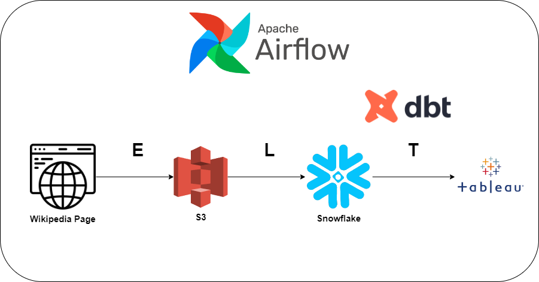

<br/>
<p align="center">
  <h3 align="center">Data Engineering project for an analytical use case</h3>

</p>


## Table Of Contents

* [About the Project](#about-the-project)
* [Built With](#built-with)
* [Getting Started](#getting-started)
  * [Prerequisites](#prerequisites)
  * [Installation](#installation)
* [Author](#authors)

## About The Project




This project is an example of a modern data stack. It is a basic ELT pipeline that contains the following stages:
- Extraction: Web scraping of Wikipedia's page containing ranked lists of Spanish municipalities.
- Load: Loading data into a data warehouse into the raw layer.
- Transform: dbt is the T in the ELT. Include the **great expectations** in the source layer to validate data. After, we will transform the data to model it in a **Kimball** data mart.

The orchestration tool will be in charge of the entire workflow. The goal is to showcase the data in a dashboard created by a BI tool like Tableau. 

Please note that this project is for learning purposes only.


## Built With
* Primary languages: Python and SQL
* Beautifulsoup for web scraping
* Pandas for handling data
* Orchestration tool: Apache Airflow 2.8.0 deployed using Docker
* Object storage (Data Lake): AWS S3
* Data Warehouse: Snowflake
* Transformation tool: DBT


## Getting Started


### Prerequisites

First, you need an **aws account** and **Snowflake account** with the appropriate services created (S3 bucket, databases and schemas on Snowflake, etc...)

You need to create an environment file at the same level where the docker-compose file will be and put in the **S3_ACCESS_KEY** and **S3_SECRET_KEY**.

### Installation


1. Clone the repo

```sh
git clone https://github.com/alepiupin/spain-cities-data-engineering-showcase.git
```

2. Run docker containers

```sh
docker-compose up -d --build
```

## Author

* **Alejandro Piury** - *Data Engineer* - [Alejandro Piury](https://github.com/alejandropiuryp/)
